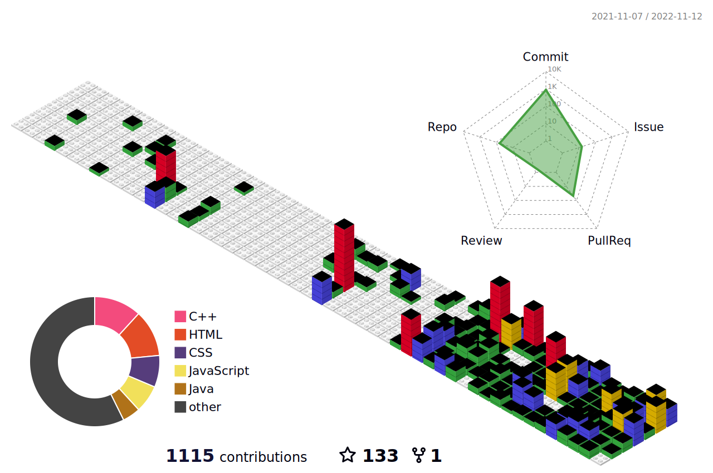

<!--  -->

 

<h1 align="center">Hi 👋, I'm Samuel Majok</h1>

<h3 align="center">A passionate frontend developer</h3>

 
<table border="0">
 <tr>
    <td>
      
     <strong>HELLO WORLD!</strong>
     
     - 🔭 I’m currently working on My Portfolio

     - 🌱 Huge advocate of open source

     - 👯 I’m looking to collaborate on anything Javascript

     - 👨‍💻 All of my projects are available in my Repositories

     - 📝 Your welcome to challenge me on Algorithms using C++

     - 💬 Reach out on my email at samuelmajuk@gmail.com
     
   <td>
      
   </td>  
 </tr>  
</table>
 

 
 

   
   

