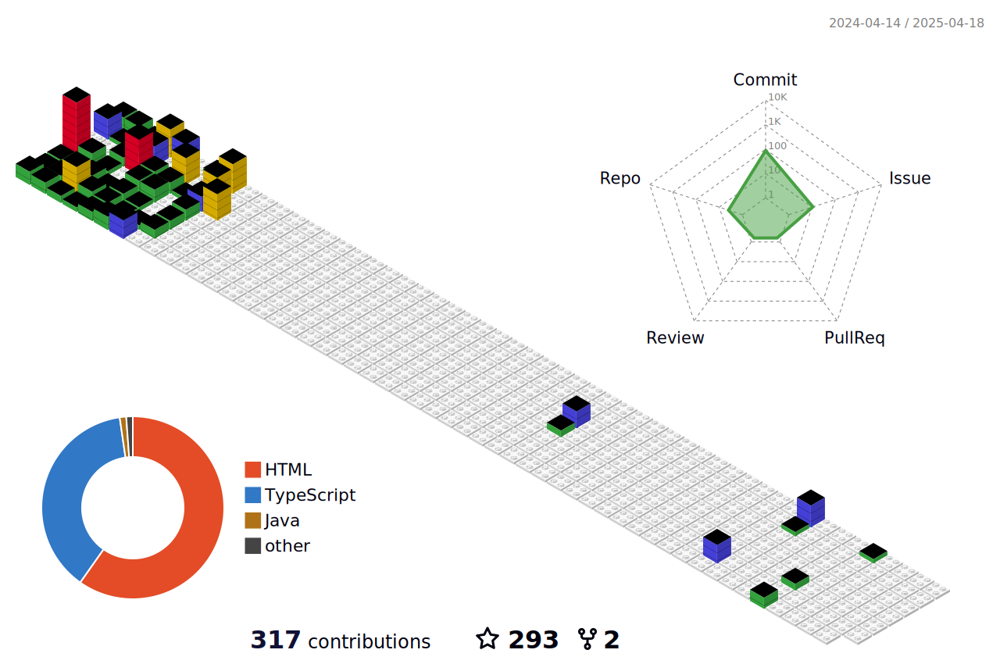

<h1 align="center">Hi 👋, I'm Samuel Majok</h1>
<h3 align="center">A passionate frontend developer</h3>

 

<table border="0">
 <tr>
    <td> 
      
     <strong>HELLO WORLD!</strong>
     
     - 🔭 I’m currently working on My Portfolio

     - 🌱 I'm also currently learning the React Framework

     - 👯 I’m looking to collaborate on anything Javascript

     - 👨‍💻 All of my projects are available on my Repositories

     - 📝 I regularly write articles on My Blog

     - 💬 Ask me about anything Javascript

     - 📫 Reach out at samuelmajuk@gmail.com
     
     - 🤙 You can also contact me +2011 2276 1343
     
   </td>
  
   <td>
      
   </td>
 </tr>
  
</table>

 

      

